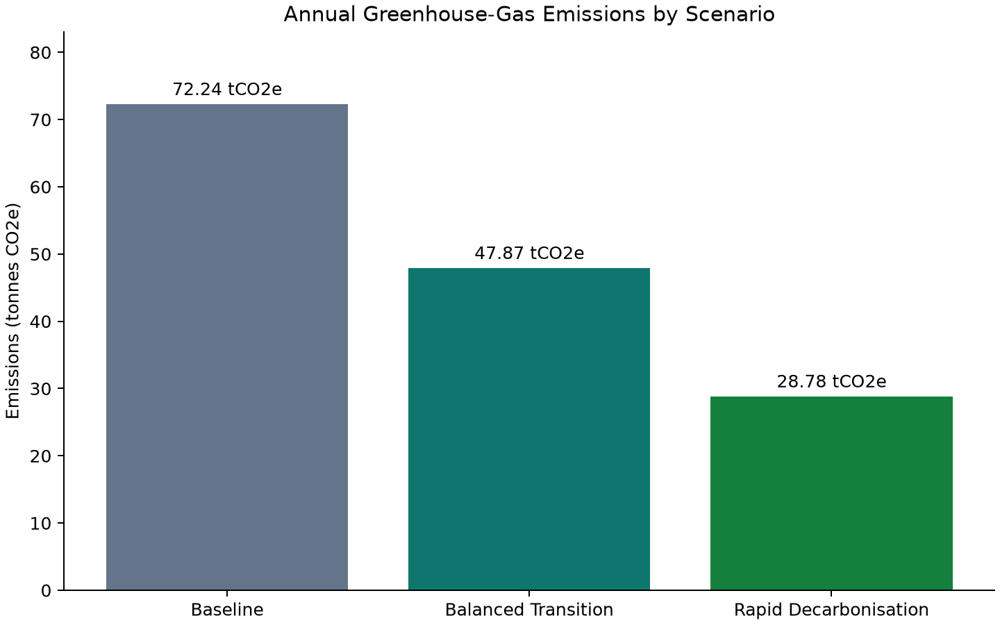
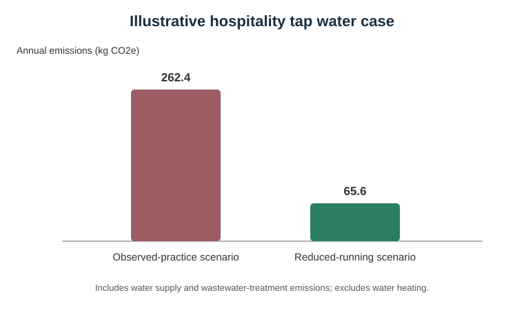
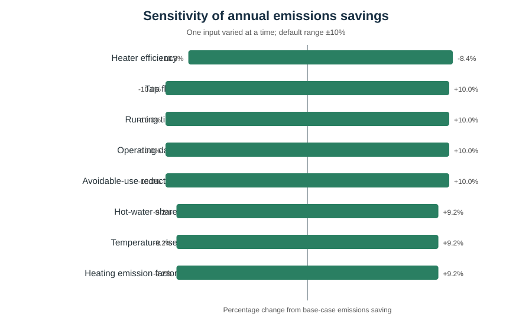
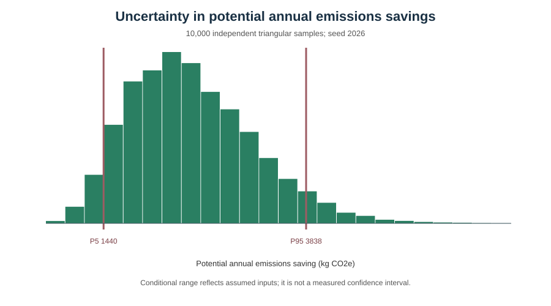
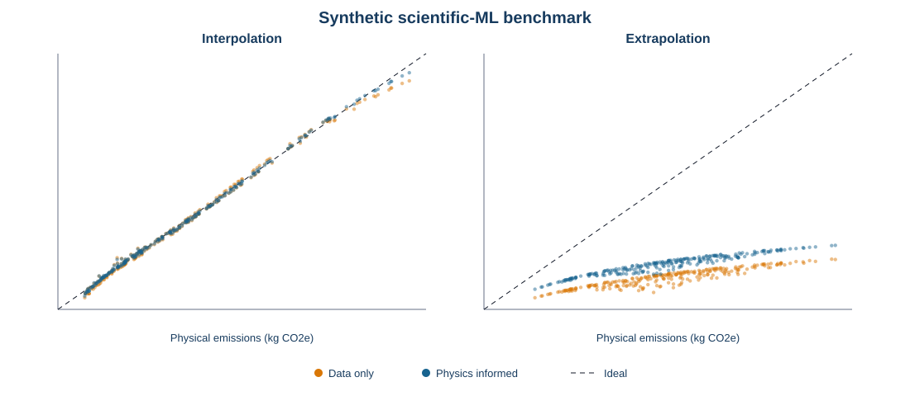
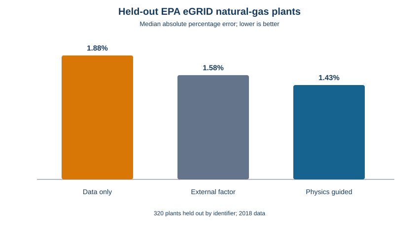

# Cross-Sector Greenhouse Gas Scenario Model

[](pyproject.toml)
[](#ethical-and-reproducibility-note)

Related work: this project's uncertainty and evidence-based approach follows the same research direction as trustlens-ai (calibrated, human-governed ML) and hospitality-sustainability-ai (real-world operational validation).

A small, transparent Python model for estimating greenhouse-gas emissions and testing reduction scenarios across electricity, heating, transport, waste, and industrial activity.

This portfolio project was created to demonstrate reproducible modelling, scenario design, uncertainty analysis, documentation, and version-control-ready research practice. It is a prototype, not a regulatory carbon-accounting tool.

**Research agenda:**
[`Transparent Cross-Sector Emissions Scenarios Under Parameter Uncertainty`](docs/research_agenda.md)

## At a glance

| Research element | Current implementation |
|---|---|
| System | Electricity, heating, transport, waste and industrial modules |
| Core method | Auditable `activity × emission factor` calculations |
| Intervention analysis | Editable baseline, balanced-transition and rapid-decarbonisation scenarios |
| Uncertainty | One-at-a-time sensitivity and reproducible Monte Carlo simulation |
| Applied case | Hospitality water-energy-emissions scenario |
| Scientific ML | Reproducible data-only vs physics-informed neural benchmark |
| Real-data validation | Held-out EPA eGRID natural-gas plant comparison |
| Interpretation | Conditional scenario estimates, not measurements or forecasts |

## Research question

How do different sector-level interventions change total annual greenhouse-gas emissions, and how sensitive are the results to uncertainty in activity data and emission factors?

## Research contribution

The project's research contribution is a compact, provenance-first workflow for
testing whether mitigation priorities remain stable when activity data,
emission factors, uncertainty assumptions and system boundaries change. The
goal is not to produce the largest headline reduction. It is to show which
conclusions are reproducible, which inputs dominate uncertainty and when an
apparently clear intervention ranking is too unstable to defend.

The next study phase adds a versioned factor registry, correlated uncertainty,
rank-reversal analysis and reconciliation against an independently prepared
inventory. See the [`research agenda`](docs/research_agenda.md) for the proposed
questions, hypotheses and publication boundaries.

## Method

For each activity record:

`emissions (kg CO2e) = activity × emission factor`

A scenario changes activity, the emission factor, or both. Independent relative uncertainties are combined using root-sum-of-squares propagation.

## Included scenarios

- `baseline`: no intervention
- `balanced_transition`: lower electricity demand, grid decarbonisation, heating efficiency, transport electrification, waste reduction, and industrial efficiency
- `rapid_decarbonisation`: more ambitious reductions across the same sectors

## Quick start

```bash
python -m venv .venv
.venv\Scripts\activate
pip install -e .
ghg-model --activities data/sample_activities.csv --scenarios data/scenarios.json --output outputs/results.csv
ghg-chart
python -m unittest discover -s tests -v
```

On macOS/Linux, activate the environment with `source .venv/bin/activate`.

## Example output



## Hospitality water-use case study

The repository also includes a small case study motivated by firsthand observation of
restaurant operations: taps may remain running during repeated utensil-rinsing tasks.
This is treated as a research question, not as a claim about a named employer or a
formally measured site.

The demonstration asks: **How much water and associated water-system emissions could
be avoided by reducing unnecessary tap-running time while preserving food-safety and
service requirements?**

```bash
ghg-water-case
```

The default example uses transparent, editable assumptions:

- tap flow: 6 litres per minute (illustrative; measure before real use)
- running time: 7.5 hours per operating day (midpoint of a 7-8 hour observation)
- operating days: 300 per year (illustrative)
- avoidable-use reduction: 75% (scenario assumption, not a forecast)
- hot-water share: 50% (illustrative)
- inlet/outlet temperature: 12/45 degrees C (illustrative)
- heater efficiency: 90% and heating factor: 0.18231 kg CO2e/kWh

It applies UK Government 2026 water-supply, water-treatment and natural-gas factors.
Water-heating demand is calculated from water mass, specific heat capacity,
temperature rise and heater efficiency. Water temperature, hot-water share and heater
technology were not measured, so the defaults are explicitly illustrative and the CLI
allows every value to be replaced. Water-system and heating emissions are reported
separately to keep the system boundary auditable.



### One-at-a-time sensitivity analysis

The sensitivity command varies one input at a time around the base case, recalculates
potential total emissions savings and ranks parameters by their largest percentage
effect on the output:

```bash
ghg-sensitivity --variation-pct 10
```

The default ±10% range is a local diagnostic, not a confidence interval. It answers
which inputs the model responds to most strongly near the selected base case. It does
not represent correlations, probability distributions or uncertainty in the observed
7-8 hour running-time statement. Those questions require a separate uncertainty
analysis.



### Monte Carlo uncertainty analysis

The Monte Carlo command samples transparent triangular ranges for flow, running time,
operating days, avoidable use, hot-water share, temperatures, heater efficiency and
the heating emission factor:

```bash
ghg-monte-carlo --samples 10000 --seed 2026
```

The fixed seed makes results reproducible. Inputs are currently sampled independently,
which is a simplifying assumption because real operating variables may be correlated.
The reported P5-P95 interval is conditional on the selected ranges and distribution
shapes; it is not a measured confidence interval and should be updated when field data
become available.



### Scientific-machine-learning foundation experiment

The repository includes a compact neural-surrogate benchmark that compares a
data-only objective with a physics-informed objective containing the known
`emissions = activity × emission factor` relationship. It evaluates both held-out
interpolation and deliberate extrapolation beyond the synthetic training range:

```bash
ghg-sciml
```



This is an educational foundation experiment on synthetic data, not industrial
validation or evidence of expertise with scientific foundation models. The complete
design and progression path are documented in
[`docs/scientific_ml_benchmark.md`](docs/scientific_ml_benchmark.md).

The locked default run reduced interpolation RMSE by 35.8% and extrapolation RMSE by
12.2% relative to the identical data-only network. Extrapolation error remained high,
which is reported as a negative result and a reason to study stronger architectures,
uncertainty methods and genuine scientific datasets.

## First real-data validation

The first real-data benchmark compares estimates against reported annual CO2 from
held-out natural-gas plants in an official EPA eGRID-derived 2018 layer. It excludes
target-derived emission-rate fields and uses the EPA GHG Emission Factors Hub value
of 53.06 kg CO2/MMBtu as an external physical constraint:

```bash
ghg-real-validation
```



This is an unseen-plant test within one historical US data year. It is not temporal,
contemporary, European or cross-sector validation. The locked design, provenance,
leakage controls and interpretation boundaries are documented in
[`docs/real_data_validation.md`](docs/real_data_validation.md).

On the locked 320-plant holdout, the physics-guided residual model reduced
median absolute percentage error from 1.88% to 1.43% relative to the data-only
ridge model. Its RMSE was 0.06% worse, so the project reports the improvement
in typical relative error without claiming that the hybrid wins every metric.

## Data and provenance

`data/sample_activities.csv` contains a synthetic demonstration dataset. Its emission factors are illustrative and must not be used for formal reporting. The model keeps factor year, source, unit, and uncertainty alongside every record so authoritative factors can be substituted without changing the code.

For a real study, use the latest UK Government greenhouse-gas conversion-factor flat file or another jurisdiction-appropriate inventory source, document all mapping decisions, and retain the original source version. Relevant methodological foundations include:

- UK Government greenhouse-gas reporting conversion factors: https://www.gov.uk/government/collections/government-conversion-factors-for-company-reporting
- UK Government conversion factors 2026: https://www.gov.uk/government/publications/greenhouse-gas-reporting-conversion-factors-2026
- UK Government 2026 methodology report: https://assets.publishing.service.gov.uk/media/6a2940543b15d05a7ce3202e/2026-GHG-conversion-factors-methodology-report.pdf
- 2006 IPCC Guidelines for National Greenhouse Gas Inventories: https://www.ipcc-nggip.iges.or.jp/public/2006gl/

## Repository structure

```text
data/                  Synthetic activities and scenario assumptions
src/ghg_model/         Model and command-line interface
tests/                 Unit tests
outputs/               Generated results (created when the model runs)
```

## Limitations and next steps

- Replace illustrative factors with an automated, versioned import from an authoritative source.
- Add direct and indirect emissions with explicit Scope 1, 2, and 3 treatment.
- Add spatial and hourly resolution for integration with an energy-system model.
- Model correlations and probability distributions using Monte Carlo simulation.
- Validate sector mappings and scenario assumptions with domain experts.
- Add optimisation to identify least-cost pathways subject to an emissions target.
- Test whether intervention rankings reverse across plausible input distributions.
- Reconcile one complete case against an independently prepared inventory.

## Ethical and reproducibility note

Results are only as reliable as their boundaries, data, factors, and assumptions. Scenario outputs should be reported with uncertainty and should not be presented as forecasts.
